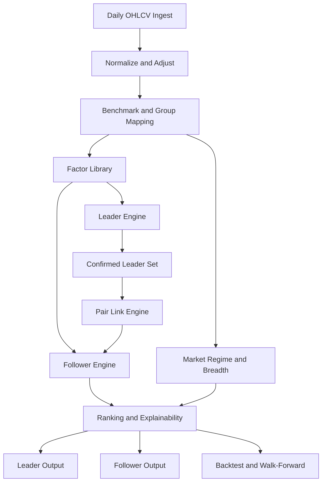

# Leader-Lagging Multi-Factor Screener PRD

작성일: 2026-03-12

## 1. 문서 목적

이 문서는 `주도주(leader stock)`와 `후행 2등주(lagging follower)`를 탐지하는 정량 스크리너를 `실제 제품 요구사항(PRD)` 수준으로 발전시키기 위한 문서다.

이번 버전의 목표는 단순 아이디어 정리가 아니다. 정확한 목표는 아래 5가지다.

1. `KR/US 종목의 daily OHLCV`만으로도 동작 가능한 MVP를 정의한다.
2. RS/RS Line을 핵심 축으로 포함하되, 그것만으로 스크리닝하지 않는 `멀티팩터 구조`를 정의한다.
3. 주도주와 2등주를 같은 점수로 섞지 않고, `별도 엔진`으로 분리한다.
4. 이후 재무, 실적, 산업분류, 뉴스, 공급망 데이터를 붙여도 구조가 깨지지 않는 `확장 가능한 데이터 계약`을 정의한다.
5. 백테스트, 워크포워드, 거래비용 반영까지 포함한 `검증 가능한 제품 사양`으로 정리한다.

## 2. 제품 한 줄 정의

이 제품은 `시장/그룹 강도 + RS/RS Line + 추세/구조 + 거래량/유동성 + 리드-래그`를 결합해,

- 지금 시장의 `진짜 리더주`
- 같은 흐름 안에서 아직 덜 반영된 `후행 2등주`

를 따로 찾아내는 `OHLCV-first 멀티팩터 스크리너`다.

## 3. 핵심 설계 원칙

### 3.1 OHLCV-first

- MVP는 `조정 OHLCV + 벤치마크 시계열 + 최소한의 종목 메타데이터`만 있으면 돌아가야 한다.
- 재무, 실적, 뉴스, 산업분류, 공급망은 있으면 좋지만, 없다고 제품이 멈추면 안 된다.

### 3.2 RS는 필수 feature지만 단독 엔진은 아니다

- RS/RS Line은 반드시 포함한다.
- 그러나 최종 선별은 `그룹 강도`, `추세`, `구조`, `거래량`, `유동성`, `이벤트`, `리드-래그`를 함께 본다.

### 3.3 Leader와 Follower는 분리한다

- `Leader`는 이미 리더십이 확인된 종목이다.
- `Follower`는 단순 약세주가 아니라, 강한 그룹 안에서 `정보 확산이 늦은 추종 후보`다.
- 따라서 둘은 서로 다른 하드 게이트와 서로 다른 점수식이 필요하다.

### 3.4 KR/US를 같은 철학으로 다룬다

- 국가가 달라도 철학은 동일해야 한다.
- 다만 `가격 단위`, `거래대금 단위`, `시장 휴장일`, `벤치마크`, `산업분류 공급자`는 설정값으로 분리한다.

### 3.5 Optional data는 점수에서 중립 처리한다

- 재무나 이벤트 데이터가 없으면 해당 모듈은 `결측 페널티`가 아니라 `비활성` 처리한다.
- 점수는 `활성 모듈의 가중치만 재정규화`해서 계산한다.

## 4. 제품 범위

### 4.1 반드시 구현할 것

- KR/US 일봉 OHLCV ingest
- benchmark/sector/group 매핑 레이어
- relative strength 모듈
- market regime / breadth 모듈
- leader screener
- lagging follower screener
- pair/link engine
- 점수 설명 가능한 output layer
- 백테스트 및 워크포워드 프레임

### 4.2 나중에 붙일 것

- 실적/재무 enrichment
- 뉴스 및 catalyst parser
- 공급망 / 고객-벤더 그래프
- shared analyst coverage
- intraday alert
- 자동 실행 엔진

### 4.3 의도적으로 제외할 것

- 저점 반등만 노리는 mean reversion 시스템
- pure stat-arb pair trading
- HFT/마이크로초 execution
- 재무 데이터 없이는 동작 불가능한 설계

## 5. 사용자 시나리오

### 5.1 주간 리더주 발굴

사용자는 주말 또는 주초에 전체 유니버스에서 `다음 주의 리더 후보`를 뽑고 싶다.

### 5.2 일간 2등주 탐색

사용자는 이미 리더가 나온 섹터/테마 안에서 `아직 덜 오른 추종주`를 매일 갱신해 보고 싶다.

### 5.3 이벤트 후 재정렬

사용자는 실적 갭업, 정책 변화, 섹터 ETF 강세 직후에 `sympathy move` 가능성이 높은 후행 종목을 찾고 싶다.

### 5.4 구현 관점

개발자는 이후 새로운 데이터 소스가 생겨도 핵심 점수 로직을 갈아엎지 않고 `feature module`만 추가하고 싶다.

## 6. 핵심 정의

### 6.1 주도주

본 PRD에서 주도주는 아래를 동시에 만족하는 종목이다.

- 시장 또는 섹터 대비 초과성과가 있다.
- RS/RS Line이 강하다.
- 같은 그룹 안에서도 상위권이다.
- 추세와 구조가 손상되지 않았다.
- 거래량과 유동성이 실전 운용 가능한 수준이다.

### 6.2 후행 2등주

본 PRD에서 후행 2등주는 아래를 의미한다.

- 이미 확인된 leader와 같은 산업, 테마, 또는 강한 연결고리가 있다.
- 그룹은 강하지만 본인은 아직 leader만큼 반영되지 않았다.
- 구조가 망가지지 않았다.
- RS Line이 개선 초기이거나 RS Rank가 회복 중이다.
- 즉, 단순 laggard가 아니라 `delayed winner candidate`다.

### 6.3 Relative Strength 계열 용어

- `RS Line`: `stock_close / benchmark_close`
- `RS Rank / RS Percentile`: 유니버스 내 상대성과 백분위
- `Mansfield RS`: RS Line을 장기 평균 대비 정규화한 오실레이터
- `RS New High Before Price`: 가격 신고가 이전에 RS Line이 먼저 신고가를 만드는 상태

## 7. 입력 데이터 계약

### 7.1 MVP 필수 입력

- `symbol`
- `market`
  - 예: `KR`, `US`
- `date`
- `open`
- `high`
- `low`
- `close`
- `adj_close`
- `volume`
- `benchmark_close`
  - broad benchmark 1개 이상

### 7.2 MVP 권장 입력

- `traded_value`
  - 없으면 `close * volume`으로 근사
- `sector`
- `industry`
- `shares_outstanding` 또는 `market_cap`
- `listing_status`
- `delisting_date`

### 7.3 Optional enrichment

- quarterly fundamentals
- earnings calendar / earnings surprise
- sales / EPS growth
- analyst coverage
- ETF/theme membership
- supply chain graph
- news / regulatory event tags

### 7.4 데이터 부재 시 fallback

- `sector/industry`가 없으면 provider mapping -> ETF mapping -> rolling return cluster 순으로 fallback
- `traded_value`가 없으면 `adj_close * volume` 사용
- `market_cap`이 없으면 시가총액 기반 필터를 비활성
- `financials`가 없으면 quality/catalyst 모듈을 비활성 후 나머지 가중치 재정규화

## 8. 출력물 정의

### 8.1 Primary outputs

- `Leader List`
- `Lagging Follower List`
- `Leader-Follower Pair List`
- `Market/Group Dashboard`

### 8.2 각 종목에 반드시 포함할 설명값

- 최종 label
- 최종 score
- 상위 기여 factor 3개
- 탈락 사유 또는 경고 플래그
- 연결된 leader ticker
- 관련 그룹/테마

### 8.3 예시 라벨

- `Confirmed Leader`
- `Emerging Leader`
- `Extended Leader`
- `High-Quality Follower`
- `Early Sympathy Candidate`
- `Too Weak, Reject`

## 9. 시스템 아키텍처



### 9.1 핵심 모듈

1. `Data Normalization Layer`
2. `Benchmark / Group Mapper`
3. `Market Regime Engine`
4. `Breadth Engine`
5. `Relative Strength Module`
6. `Trend / Structure Module`
7. `Volume / Liquidity Module`
8. `Leader Engine`
9. `Follower Engine`
10. `Pair Link / Lead-Lag Engine`
11. `Ranking / Explainability Layer`
12. `Validation Layer`

## 10. 데이터 정규화 및 국가별 처리

### 10.1 조정주가 원칙

- 가능한 한 `adj_close`를 사용한다.
- 한국은 권리락, 액면분할, 무상증자 반영이 누락되면 RS Line이 크게 왜곡될 수 있다.
- 미국은 배당 반영 여부가 장기 RS에 영향을 줄 수 있으므로 total-return 일관성을 우선 확인한다.

### 10.2 거래일 캘린더

- KRX와 US market holiday가 다르므로 공통 달력에 억지로 맞추지 않는다.
- 각 시장별로 시계열을 계산한 뒤, cross-market 비교는 주간/월간 단계에서만 수행한다.

### 10.3 통화 단위

- 가격 단위는 원화/달러가 다르므로 price floor는 원칙적으로 피한다.
- 유동성 필터는 `거래대금`, `ADV percentile`, `turnover percentile` 중심으로 설계한다.

### 10.4 생존편의 방지

- 백테스트에는 delisting 포함 유니버스가 필요하다.
- 상장폐지, 거래정지, ticker change를 이력으로 유지한다.

## 11. 벤치마크 및 그룹 매핑

### 11.1 broad benchmark

시장별 broad benchmark는 설정 가능해야 한다.

- KR 예시: `KOSPI200`, `KOSDAQ150`
- US 예시: `SPY`, `QQQ`, `RSP`

### 11.2 sector / industry benchmark

- sector benchmark가 있으면 우선 사용한다.
- 없으면 동일 그룹 종목의 equal-weight basket을 synthetic benchmark로 만든다.

### 11.3 fallback hierarchy

1. 공식 sector/industry classification
2. ETF/theme mapping
3. rolling correlation cluster
4. return co-movement graph

## 12. Market Regime and Breadth Engine

### 12.1 목적

leader와 follower는 모두 `시장과 그룹이 받쳐주는 구간`에서 성능이 좋아진다. 따라서 개별 종목 점수 전에 시장 gate가 필요하다.

### 12.2 필수 상태값

- `benchmark_close > MA50 > MA200`
- `MA200 slope > 0`
- `pct_above_50dma`
- `pct_above_200dma`
- `new_high_count`
- `new_low_count`
- `high_low_ratio`
- `top_group_share`

### 12.3 권장 market state

- `Risk-On`
- `Neutral`
- `Risk-Off`

### 12.4 활용 방식

- hard reject보다 `score multiplier`와 `position budget`에 먼저 반영한다.
- 예: `Risk-Off`에서는 후보는 보여주되 conviction label을 낮춘다.

## 13. 공통 팩터 라이브러리

### 13.1 모듈 분류

- `Relative Strength`
- `Trend Integrity`
- `Price Structure`
- `Volume Demand`
- `Liquidity Quality`
- `Group Strength`
- `Breadth Context`
- `Catalyst / Quality`
- `Pair Link / Lead-Lag`

### 13.2 점수 표준화 원칙

가능한 한 factor는 아래 순서로 처리한다.

```text
raw feature -> winsorize(+/-3) -> z-score -> direction align -> weighted combine
```

운영 정의:

```text
z_i = clip((x_i - mu_i) / sigma_i, -3, 3)
Composite = sum(w_i * z_i) / sum(active_w_i)
```

이 구조는 이후 재무/이벤트 feature가 추가되어도 일관되게 확장된다.

## 14. Relative Strength Module

### 14.1 RS Line

```text
RS_Line_t = AdjClose_stock_t / AdjClose_benchmark_t
```

### 14.2 Weighted RS Rank

기본안은 12개월을 4개 분기로 나눠 최근 분기에 더 큰 가중치를 준다.

```text
Weighted_RS = 0.40 * R_0_3M
            + 0.20 * R_3_6M
            + 0.20 * R_6_9M
            + 0.20 * R_9_12M

RS_Rank = PercentileRank(Weighted_RS within universe)
```

### 14.3 12-1 Momentum

OHLCV 입력만 있어도 월말 리샘플링으로 `12-1 momentum`을 계산할 수 있다.

```text
MOM_12_1 = Price_{t-1M} / Price_{t-12M} - 1
```

### 14.4 Normalized Momentum Score

표준화 버전은 아래 2개를 병행 지원한다.

- `IBD-style weighted RS rank`
- `MSCI/S&P-style normalized momentum`

정규화 예시:

```text
NormMom = 0.5 * z(6M ex-1M risk-adjusted momentum)
        + 0.5 * z(12M ex-1M risk-adjusted momentum)
```

### 14.5 RS 상태 변수

- `rs_rank`
- `rs_line_20d_slope`
- `rs_line_65d_high_flag`
- `rs_line_250d_high_flag`
- `rs_new_high_before_price_flag`
- `mansfield_rs`
- `delta_rs_rank_qoq`

### 14.6 RS 해석 원칙

- `RS Rank`는 상대 순위다.
- `RS Line`은 시계열 구조다.
- `delta_rs_rank_qoq`는 개선 방향성이다.
- `Mansfield RS`는 zero-line 기반 정규화 관찰값이다.

## 15. Trend / Structure Module

### 15.1 Trend Integrity

주요 상태값:

- `close > MA50 > MA150 > MA200`
- `MA200 slope > 0`
- `weekly close > MA30w`
- `distance_from_MA50`
- `distance_from_MA200`

### 15.2 Price Structure

OHLCV만으로 계산 가능한 구조 feature:

- `distance_to_52w_high`
- `distance_from_52w_low`
- `base_length`
- `base_tightness`
- `volatility_contraction`
- `range_compression`
- `pivot_proximity`

### 15.3 52주 고점 근접도

```text
distance_to_52w_high = 1 - Close / HHV_252
```

leader는 이 값이 낮을수록 좋고, follower는 적당히 낮되 `너무 멀리 무너지지 않은 상태`가 중요하다.

## 16. Volume / Liquidity Module

### 16.1 거래량 수요

- `ADV20`
- `ADV50`
- `traded_value_20d`
- `RVOL = volume / avg(volume, 50)`
- `up_volume_ratio`
- `down_volume_ratio`
- `breakout_volume_expansion`

### 16.2 유동성 품질

OHLCV만으로 만들 수 있는 비용 proxy:

```text
ILLIQ = mean(|return| / traded_value)
```

Optional proxy:

- `Corwin-Schultz spread estimate`
- `Roll spread estimate`

### 16.3 cross-market threshold 원칙

- 절대 가격 기준보다 `거래대금 percentile`을 우선한다.
- 국가별로 최소 거래대금 config를 둘 수 있다.
- 최종 기본값은 `market-specific floor`와 `universe percentile floor` 중 큰 값을 사용한다.

## 17. Group Strength Module

### 17.1 그룹 강도는 선행 게이트다

필수 상태값:

- `industry_rs_pct`
- `sector_rs_pct`
- `group_mansfield_rs`
- `group_return_20d`
- `group_return_60d`
- `group_pct_above_50dma`
- `group_new_high_share`

### 17.2 활용 원칙

- leader도 follower도 약한 그룹에서는 우선순위를 낮춘다.
- follower는 개별 종목보다 `그룹 강도`의 영향을 더 크게 받는다.

## 18. Optional Catalyst / Quality Module

### 18.1 붙일 수 있는 데이터

- EPS growth
- sales growth
- earnings surprise
- margin trend
- ROE
- debt / Altman-style distress proxy
- guidance revision

### 18.2 운영 원칙

- 이 모듈은 MVP에 필수는 아니다.
- 존재하면 점수에 가산하되, 결측이면 전체 점수를 깎지 않는다.
- event-driven follower에서는 `earnings gap up`, `guidance up`, `sector news`를 우선 쓴다.

## 19. Leader Engine

### 19.1 리더주 철학

리더주는 아래를 함께 만족해야 한다.

- 강한 그룹 안에 있다.
- RS가 높다.
- RS Line이 강하거나 선행 신고가를 만든다.
- 가격이 고점 근처에 있으며 구조가 타이트하다.
- 거래량과 유동성이 받쳐준다.

### 19.2 OHLCV-only 하드 게이트

- `close > MA50 > MA150 > MA200`
- `MA200 slope > 0`
- `rs_rank >= 85`
- `industry_rs_pct >= 75`
- `distance_to_52w_high <= 0.20`
- `ADV20_value`가 최소 유동성 기준 이상
- `ILLIQ`가 상위 비유동성 구간이 아님

### 19.3 강화 게이트

아래 중 2개 이상 충족 시 `Tier 1 leader`로 승격한다.

- `rs_rank >= 92`
- `rs_line_250d_high_flag = true`
- `rs_new_high_before_price_flag = true`
- `RVOL >= 1.5`
- `group_new_high_share` 상위 구간

### 19.4 리더 점수

```text
LeaderScore =
    0.18 * GroupStrengthScore
  + 0.18 * TrendIntegrityScore
  + 0.14 * StructureQualityScore
  + 0.14 * RSRankScore
  + 0.10 * RSLineScore
  + 0.08 * VolumeDemandScore
  + 0.08 * LiquidityQualityScore
  + 0.05 * BreadthContextScore
  + 0.05 * OptionalCatalystScore
```

설명:

- RS 관련 항목 비중은 높지만 24%에 그친다.
- 즉 leader 판정은 `RS-only`가 아니라 `그룹 + 추세 + 구조 + 유동성 + RS`의 결합이다.

### 19.5 라벨링

- `Confirmed Leader`: 상위 score + RS/구조/그룹 동시 강세
- `Emerging Leader`: RS는 강하지만 구조가 아직 완성 전
- `Extended Leader`: leader지만 과열/거리 벌어짐

## 20. Lagging Follower Engine

### 20.1 follower 철학

후행 2등주는 아래 상황을 찾는다.

- 리더와 같은 그룹/테마에 속한다.
- 리더보다 덜 올랐다.
- 그러나 구조는 살아 있다.
- RS Line은 개선 초기다.
- 정보 확산 또는 sympathy move가 아직 남아 있다.

### 20.2 follower는 laggard와 다르다

아래는 follower가 아니다.

- 그룹이 약한데 혼자 못 오른 종목
- 장기 하락 추세에서 단지 저가인 종목
- 거래비용이 너무 높아 실전 접근이 어려운 종목
- 악재로 구조가 이미 훼손된 종목

### 20.3 하드 프리컨디션

- 같은 산업/테마 안에 `Confirmed Leader`가 최소 1개 존재
- `industry_rs_pct >= 75`
- `close > MA50`
- `distance_to_52w_high <= 0.25`
- `65 <= rs_rank < 90`
- `delta_rs_rank_qoq > 0`
- `ADV20_value`가 최소 유동성 기준 이상

### 20.4 위생 필터

- `close < MA200`이고 회복 신호가 없으면 제거
- `drawdown_from_52w_high > 0.30`이면 제거
- `ILLIQ` 최악 구간 제거
- leader 대비 구조 훼손이 크면 제거

### 20.5 Catch-up Gap

```text
LeaderGap_20d = Return_leader_20d - Return_candidate_20d
LeaderGap_60d = Return_leader_60d - Return_candidate_60d
```

권장 해석:

- 둘 다 양수여야 한다.
- 너무 작으면 이미 동행했고,
- 너무 크면 그냥 약한 종목일 가능성이 높다.

### 20.6 Propagation Ratio

```text
PropagationRatio_20d = Return_candidate_20d / Return_leader_20d
```

권장 구간:

- `0.25 <= PropagationRatio_20d <= 0.85`

### 20.7 RS inflection

필수 조건:

- `rs_line_20d_slope > 0`
- `mansfield_rs_slope > 0`
- `delta_rs_rank_qoq > 0`

가산 조건:

- `rs_line_65d_high_flag = true`
- `rs_new_high_before_price_flag = true`
- `mansfield_rs`가 음수에서 양수로 전환

### 20.8 follower 점수

```text
FollowerScore =
    0.25 * PairLinkScore
  + 0.18 * GroupStrengthScore
  + 0.15 * UnderreactionScore
  + 0.12 * TrendIntegrityScore
  + 0.10 * RSInflectionScore
  + 0.08 * VolumeDemandScore
  + 0.07 * LiquidityQualityScore
  + 0.05 * BreadthContextScore
```

설명:

- follower에서 가장 중요한 것은 `연결성`과 `underreaction`이다.
- RS는 확인 도구이지만, 후보군 정의의 전부는 아니다.

### 20.9 follower 라벨링

- `High-Quality Follower`
- `Early Sympathy Candidate`
- `Watch Only`
- `Too Weak, Reject`

## 21. Pair Link / Lead-Lag Engine

### 21.1 MVP 연결 규칙

MVP에서는 아래만으로 충분하다.

- same industry
- same theme basket
- rolling return correlation
- leader event window overlap

### 21.2 확장 연결 규칙

- shared analyst coverage
- customer / supplier relation
- shared ETF ownership
- segment overlap

### 21.3 PairLinkScore

```text
PairLinkScore =
    0.45 * SameIndustry
  + 0.20 * SameSubIndustry
  + 0.15 * SameTheme
  + 0.10 * RollingCorrelationScore
  + 0.10 * EventOverlapScore
```

### 21.4 Lead-Lag Beta

고급 모듈에서는 leader의 과거 수익률이 follower의 이후 수익률을 얼마나 설명하는지 본다.

```text
R_follower,t = alpha + beta1 * R_leader,t-1 + e_t
```

운영 규칙:

- `beta1 > 0`
- 최근 rolling window에서 안정적으로 양수
- 가능하면 유의성까지 확인

### 21.5 사용 원칙

- MVP에서는 통계 유의성까지 강제하지 않는다.
- V2부터 rolling beta와 주간 pair 회귀를 추가한다.

## 22. 점수 정규화와 결측 처리

### 22.1 winsorization

모든 연속형 factor는 기본적으로 `+/-3 sigma`에서 잘라낸다.

### 22.2 missing neutralization

```text
FinalScore = sum(active_weight_i * factor_i) / sum(active_weight_i)
```

### 22.3 categorical flags

다음과 같은 binary flag는 additive boost 또는 hard gate로 사용한다.

- `rs_new_high_before_price_flag`
- `group_top_decile_flag`
- `risk_off_market_flag`
- `high_illiquidity_flag`

## 23. 스크리너 운영 플로우

### 23.1 주간 배치

- universe refresh
- benchmark/group recompute
- market regime refresh
- leader shortlist recompute

### 23.2 일간 배치

- OHLCV update
- RS/RS Line refresh
- leader/follower score recompute
- pair relinking

### 23.3 이벤트 배치

아래 이벤트 직후 follower를 재정렬한다.

- leader earnings gap up
- sector ETF breakout
- commodity shock
- policy / regulation catalyst

## 24. 출력 스키마

### 24.1 Leader row

- ticker
- market
- sector
- industry
- leader_score
- label
- rs_rank
- rs_line_20d_slope
- rs_new_high_before_price_flag
- distance_to_52w_high
- group_rank
- top_reason_1
- top_reason_2
- risk_flag

### 24.2 Follower row

- ticker
- linked_leader
- market
- sector
- industry
- follower_score
- label
- rs_rank
- delta_rs_rank_qoq
- rs_line_20d_slope
- leader_gap_20d
- leader_gap_60d
- propagation_ratio_20d
- pair_link_score
- top_reason_1
- top_reason_2
- risk_flag

## 25. 구현 우선순위

### 25.1 MVP

- KR/US daily OHLCV ingest
- benchmark mapping
- RS Line / RS Rank
- market regime and breadth
- leader engine
- follower engine
- simple pair link same-industry
- 백테스트 baseline

### 25.2 V2

- 12-1 momentum normalized score
- synthetic group benchmark fallback
- liquidity proxies
- event-driven rerank
- rolling lead-lag beta

### 25.3 V3

- DART / EDGAR enrichment
- earnings surprise and revision signals
- supply chain / theme graph
- explainability dashboard
- intraday alerting

## 26. 검증 계획

### 26.1 리더 검증

- score decile별 5d / 20d / 60d forward return
- benchmark 대비 초과성과
- group-relative 성과
- breakout success rate
- 거래비용 차감 후 성과

### 26.2 follower 검증

- leader event 이후 5d / 10d / 20d 성과
- leader 대비 catch-up 비율
- rejected laggard 제거 전후 성과 비교
- pair link score decile별 성과

### 26.3 공통 검증

- KR / US 분리 검증
- bull / bear / range 시장 분리 검증
- weekly vs monthly rebalance 비교
- walk-forward out-of-sample 검증

### 26.4 비용 반영

최소한 아래 두 수준을 지원한다.

- `fixed bps` 비용 모델
- `liquidity-adjusted` 비용 모델
  - traded value, illiquidity, spread proxy 기반

## 27. 데이터 취득 전략

### 27.1 MVP 철학

가격만 있으면 먼저 돈다. 나머지는 점진적으로 붙인다.

### 27.2 KR 예시

- OHLCV: KRX 계열 또는 해당 데이터를 제공하는 Python connector
- fundamentals: DART 계열 connector

### 27.3 US 예시

- OHLCV: Yahoo/Nasdaq/브로커 API 계열 connector
- fundamentals: SEC EDGAR 계열 connector

### 27.4 provider abstraction

PRD 수준 계약:

- `PriceProvider`
- `BenchmarkProvider`
- `MetadataProvider`
- `FundamentalProvider`
- `EventProvider`

각 provider는 실패해도 전체 파이프라인이 죽지 않고, 활성 모듈만 계산해야 한다.

## 28. 리스크와 함정

### 28.1 가장 큰 함정

- follower를 “못 오른 약세주”로 오해하는 것

### 28.2 RS 과신

- RS만 높다고 leader가 아니다.
- RS가 좋아도 그룹이 약하거나 거래비용이 높으면 실전 성과가 떨어질 수 있다.

### 28.3 group mapping 오류

- sector/industry 분류가 부정확하면 pair link가 오염된다.
- fallback clustering은 편리하지만 해석력이 낮아질 수 있다.

### 28.4 look-ahead bias

- earnings, delisting, index membership, sector reclassification의 시점 정렬을 엄격히 관리해야 한다.

### 28.5 overfitting

- threshold를 많이 만들수록 PRD는 정교해 보이지만 성능은 약해질 수 있다.
- 가급적 분위수, z-score, winsorize, active-weight 방식으로 일반화한다.

## 29. 명시적 비목표

- 당일 체결 최적화
- 옵션/파생 중심 시스템
- 뉴스 sentiment 단독 모델
- 저유동성 초소형주 발굴 엔진

## 30. 최종 설계 원칙

1. MVP는 `OHLCV만으로도` 돌아가야 한다.
2. RS/RS Line은 반드시 포함하지만, `멀티팩터 시스템` 안의 한 축으로 다뤄야 한다.
3. leader와 follower는 같은 점수로 섞지 않는다.
4. leader는 `그룹 강도 + 추세 + 구조 + RS + 거래량/유동성`으로 본다.
5. follower는 `연결성 + underreaction + 구조 보존 + RS inflection`으로 본다.
6. optional data는 있으면 가산, 없으면 중립 처리한다.
7. KR/US 공통 철학은 유지하되, 벤치마크와 liquidity floor는 설정값으로 분리한다.
8. 백테스트는 반드시 `leader 단독`, `follower 단독`, `동시 운용`을 따로 본다.

## 31. 참고 축

### 31.1 실전 계보

- O'Neil / IBD: RS rating, industry leadership, RS line new high
- Weinstein / Stage Analysis: relative performance, Mansfield RS, market/group-first
- Minervini: trend template, near 52-week high, high RS
- Qullamaggie: strong 1/3/6M leaders, orderly pullback, sympathy continuation

### 31.2 학술 축

- Jegadeesh-Titman: 중기 모멘텀
- Moskowitz-Grinblatt: 산업 모멘텀
- Brennan-Jegadeesh-Swaminathan: 정보 반영 지연
- Hou: industry lead-lag
- Ali-Hirshleifer: shared analyst diffusion
- 52-week high effect literature
- PEAD / limited attention literature

### 31.3 구현 철학 축

- IBD식 weighted RS rank
- MSCI/S&P식 z-score + winsorization + multi-horizon normalization
- Amihud / Roll / Corwin-Schultz 기반 거래비용 proxy