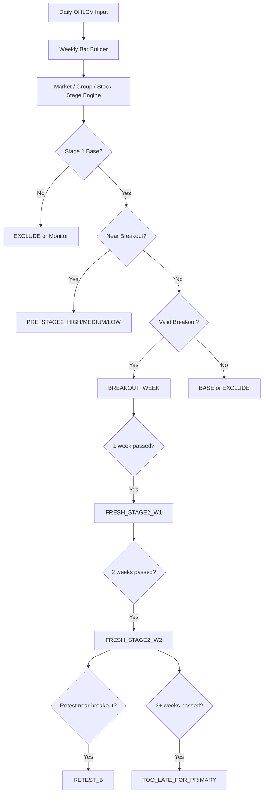

# Weinstein Early Stage 2 Screener PRD v2

작성일: 2026-03-12

## 1. 문서 목적

이 문서는 Stan Weinstein의 Stage Analysis 직접 계보 자료, 지정 사이트인 `nextbigtrade.com/stage-analysis/`, `stageanalysis.net` 계열 자료, 그리고 관련 오픈소스/보조 연구를 바탕으로 `Early Stage 2 중심 정량 스크리너`를 제품 요구사항 문서(PRD) 수준으로 정규화한 것이다.

이 PRD의 목표는 단순히 “Stage 2 종목 전반”을 넓게 찾는 것이 아니다. 정확한 목표는 아래 4개 구간에 있는 종목을 최대한 잘 걸러내는 것이다.

1. `곧 Stage 2에 돌입할 종목`
2. `이번 주 막 Stage 2에 들어온 종목`
3. `돌파 후 1주 지난 종목`
4. `돌파 후 2주 지난 종목`

반대로 아래는 primary goal이 아니다.

- 이미 Stage 2에 꽤 오래 머문 mid-stage 종목
- 돌파 후 3주 이상 경과한 종목
- continuation breakout을 주 신호로 삼는 스크리너

즉 이 제품의 본질은 `Weinstein 전체 장기추세 스크리너`가 아니라, `Stage 1 -> Early Stage 2 전환 타이밍`에 집중한 주봉 기반 top-down screener다.

## 2. 이번 버전에서 추가된 핵심 전제

이번 PRD는 기존 초안에 더해 아래 현실 조건을 명시적으로 반영한다.

1. 기본 입력은 `KR/US 개별 종목의 일봉 OHLCV 1년치`다.
2. 시스템은 이 일봉 데이터를 받아 `주봉 OHLCV`로 변환해야 한다.
3. 휴일 캘린더가 별도 주어지지 않아도 동작해야 한다.
4. 다만 이 입력 제약 때문에 Stage Analysis의 원형을 훼손하면 안 되므로, 필요한 경우 가격 히스토리/벤치마크/섹터/재무/이벤트 데이터는 별도 수집할 수 있어야 한다.
5. 입력 제약이 있어도 시스템은 hard fail보다 `bootstrap mode`로 graceful degrade 해야 한다.

### 2.1 가격 시계열 정책

- Weinstein 계열 추세/정렬 계산의 기본 입력은 `split-adjusted OHLC`다.
- `split-adjusted`는 split factor가 명시적으로 있을 때만 사용한다.
- split 근거가 없는 종목은 `raw` 시계열로 계산하되, source flag를 남겨 결과 해석에서 구분한다.
- `Adj Close` 기반 total-return 시계열은 Stage Analysis 기본 추세선의 기본 입력으로 사용하지 않는다.

## 3. 소스 통합 원칙

### 3.1 허용 소스

- Stan Weinstein 본인 저작 및 직접 인용되는 정의
- `nextbigtrade.com/stage-analysis/`
- `stageanalysis.net`의 Learn Stage Analysis / Relative Strength / Breadth / Stage 관련 자료
- Stage Analysis 계열의 직접 구현 오픈소스
- 위 기법의 구성요소를 보조적으로 뒷받침하는 논문
- 로컬 리서치 메모 `stage 2 analysis.md`에 취합된 구조화 내용

### 3.2 전략 순도 원칙

이 PRD는 Weinstein 방법론을 아래 순서로 해석한다.

`시장 Stage -> Group Relative Strength -> 개별 종목 Stage -> Early Stage 2 timing -> 진입 우선순위`

즉, 이 제품의 목적은 아무 breakout이나 찾는 것이 아니라 `시장이 받쳐주고, 그룹이 강하고, 종목이 막 Stage 2에 들어가려는 순간`을 최우선으로 포착하는 것이다.

### 3.3 명시값과 가정의 분리

Weinstein 계보 자료에는 아래 두 종류가 섞여 있다.

- 직접 명시된 값: `30주선`, `Mansfield 52주 기준`, `거래량 2배`, `최근 2년 저항`, `돌파 후 2주~2개월 소화`
- 사람의 차트 판독을 전제로 한 미명시 영역: `base가 충분히 길다`, `MA가 평평하다`, `저항이 거의 없다`

따라서 이 PRD는 아래 원칙을 따른다.

- 원문에 명시된 값은 그대로 채택한다.
- 미명시 영역은 `정량화 추론`으로 따로 표시한다.
- 데이터 부족 시에는 조용히 대체하지 말고 `fallback / confidence penalty / backfill`로 처리한다.

## 4. 제품 테제

직접 계보 자료를 종합하면 Weinstein long-side의 중심축은 아래와 같다.

1. Stage Analysis는 기본적으로 주봉 시스템이다.
2. 30주 이동평균이 Stage 판정의 중심축이다.
3. 가장 좋은 long 기회는 `Stage 1 -> Stage 2A` 전환 초기에 나온다.
4. breakout의 질은 거래량, 상대강도, 30주선 기울기, 저항 구조가 결정한다.
5. 개별 종목보다 먼저 전체 시장과 섹터/그룹 상태를 봐야 한다.
6. 시장이 Stage 4에 가까우면 좋은 패턴도 실패 확률이 높아진다.
7. 같은 Stage 2라도 `얼마나 최근에 돌파했는가`가 실전 우선순위를 크게 바꾼다.
8. 실전 적용에서는 `30주선`이 중심축이지만, `10주/50일`과 `40주/200일` 정렬도 추세 확인용 보조 하드 필터로 함께 보는 편이 원전 계보 자료와 더 가깝다.

따라서 정량 스크리너도 아래 파이프라인을 따라야 한다.

`입력 정규화 -> 주봉 변환 -> 시장 필터 -> 그룹 필터 -> Stage 1 base 판정 -> Stage 2 임박도 측정 -> Early Stage 2 freshness 판정 -> 랭킹 -> 출력`

## 5. 사용자 가치와 핵심 사용자 스토리

### 5.1 주요 사용자

- 한국/미국 주식 유니버스를 동시에 보는 discretionary trader
- weekly breakout 후보군을 정량적으로 좁히고 싶은 swing trader
- Stage Analysis를 코드화해 watchlist를 자동 생성하려는 researcher

### 5.2 핵심 사용자 스토리

- 사용자는 KR/US 종목 일봉 OHLCV 1년치만 넣어도 `이번 주 breakout 후보`와 `돌파 직후 2주 이내 후보`를 받고 싶다.
- 사용자는 휴일 정보가 따로 없어도 주봉이 자연스럽게 생성되길 원한다.
- 사용자는 1년 데이터로는 부족한 항목이 있더라도 시스템이 멈추지 않고, 무엇이 fallback인지 알 수 있기를 원한다.
- 사용자는 추가로 가격 히스토리, 벤치마크, 섹터, 재무, 이벤트 데이터를 붙여 신호 품질을 높이고 싶다.

## 6. 제품 범위

### 6.1 반드시 구현할 것

- KR/US 일봉 OHLCV 입력 파이프라인
- 주봉 변환 엔진
- benchmark resolver
- 시장 breadth / market stage gate
- 그룹 relative strength gate
- Stage 1 base 탐지
- `Pre-Stage 2` proximity detector
- `Fresh Stage 2` detector
- breakout freshness 점수
- candidate / reject 출력
- bootstrap mode와 full-fidelity mode 분기

### 6.2 이후 확장할 것

- mid/late Stage 2 continuation 모듈
- Stage 4 short-side 모듈
- 재무/이벤트 enrichment를 이용한 secondary ranking
- 자동 알림 엔진
- 포지션 사이징 및 주문 실행
- 종목별 리포트 자동 생성

### 6.3 의도적으로 제외할 것

- 일봉 패턴 자체를 주 신호로 삼는 시스템
- continuation breakout을 primary signal로 삼는 설계
- Weinstein과 직접 연결되지 않은 성장주 스타일 필터
- 휴일 캘린더가 없다는 이유로 synthetic trading day를 만드는 설계

## 7. 입력 데이터 계약

### 7.1 최소 입력 스키마

입력 테이블은 최소 아래 컬럼을 가진다.

- `symbol`
- `market`  
  예: `US`, `KR`
- `date`  
  해당 시장의 거래일 기준 날짜
- `open`
- `high`
- `low`
- `close`
- `volume`

### 7.2 권장 추가 컬럼

- `exchange`  
  예: `NASDAQ`, `NYSE`, `KOSPI`, `KOSDAQ`
- `currency`
- `adjusted_close`
- `split_factor`
- `dividend`
- `sector`
- `industry_group`
- `market_cap`
- `shares_outstanding`

### 7.3 기본 입력 가정

- 입력은 종목별로 최소 최근 1년의 일봉 OHLCV를 가진다.
- `date`는 intraday timestamp가 아니라 `market-local session date`로 취급한다.
- 휴장일은 row가 없을 뿐, 별도 holiday flag는 제공되지 않는다.
- 모든 계산은 row가 존재하는 실제 거래일만 기준으로 한다.

## 8. 벤치마크와 보조 데이터 정책

### 8.1 benchmark resolver

상대강도를 위해 각 종목에는 benchmark가 필요하다.

기본 정책:

- `US` 종목: `S&P 500` 계열 지수 또는 ETF를 기본 benchmark로 사용
- `KR / KOSPI` 종목: `KOSPI` 계열 지수를 기본 benchmark로 사용
- `KR / KOSDAQ` 종목: `KOSDAQ` 계열 지수를 기본 benchmark로 사용

예외:

- exchange 정보가 없으면 국가 단위 broad benchmark를 사용한다.
- 향후 sector-specific benchmark를 붙일 수 있지만 MVP에서는 broad benchmark가 기본이다.

### 8.2 추가 수집 가능한 데이터

PRD 차원에서 아래 데이터는 `optional but recommended enrichment`로 정의한다.

- 장기 가격 히스토리 추가 수집
- benchmark 히스토리 추가 수집
- sector / industry group 매핑
- 재무 데이터
- earnings / guidance / news catalyst
- corporate action 조정 데이터

### 8.3 설계 원칙

- 추가 데이터가 없다고 core engine이 멈추면 안 된다.
- 다만 추가 데이터가 있을수록 원전 충실도와 신호 품질은 높아진다.

## 9. 주봉 변환 엔진

Stage Analysis는 주봉 중심이므로, 본 제품의 첫 핵심 모듈은 일봉을 주봉으로 변환하는 것이다.

### 9.1 주봉 생성 규칙

각 `symbol + market + week_key` 그룹에 대해 다음처럼 집계한다.

```text
weekly_open   = first(open)
weekly_high   = max(high)
weekly_low    = min(low)
weekly_close  = last(close)
weekly_volume = sum(volume)
bar_end_date  = last(date)
session_count = count(rows)
```

### 9.2 week_key 정의

주봉 변환의 핵심은 `실제 거래가 있었던 주`를 묶는 것이다.

권장 구현:

- 각 row의 `date`를 해당 시장의 local date로 간주
- `week_key = local calendar week bucket`
- 주의 마지막 거래일이 무엇인지는 `실제 마지막 row`로 결정

즉, 금요일이 휴장이라면 목요일이 그 주의 `weekly_close`가 된다. 별도 holiday calendar 없이도 이 방식은 자연스럽게 동작한다.

### 9.3 휴일 처리 원칙

- 휴장 주간은 `거래일 row가 없으면 bar를 생성하지 않는다`
- holiday-shortened week는 `1~4개 거래일만으로도 유효한 weekly bar`로 인정한다
- synthetic weekly bar를 만들지 않는다

### 9.4 KR/US 혼합 데이터 처리

- KR와 US는 서로 다른 시장 주차를 가질 수 있다
- 하지만 상대강도는 기본적으로 `같은 시장의 benchmark`와 비교하므로, 먼저 `market` 단위로 독립 집계한다
- cross-market 직접 비교는 ranking 레이어에서 score normalization으로 처리한다

### 9.5 corporate action 처리

가능하면 `adjusted price` 기준으로 weekly OHLC를 구성한다.

원칙:

- adjusted series가 있으면 adjusted 기준으로 지표 계산
- 없으면 raw series를 사용하되 `data_quality_flag`를 낮춘다
- split / dividend 조정이 확인되면 weekly history를 재생성할 수 있어야 한다

## 10. 데이터 충분성 정책

입력은 1년 일봉이 기본이지만, Weinstein 원형을 충실히 구현하려면 더 긴 히스토리가 필요하다.

### 10.1 원형 충실도 기준

원형에 가까운 계산을 위해 필요한 대표 lookback은 아래와 같다.

- `30주 MA`
- `52주 RP/Mansfield zero line`
- `104주 overhead resistance`

즉, full-fidelity 운용에는 사실상 `2~3년 이상 일봉 히스토리`가 더 적절하다.

### 10.2 bootstrap mode

입력이 1년 일봉뿐이어도 시스템은 동작해야 하므로, 아래 bootstrap mode를 정의한다.

허용:

- 주봉 30주선 계산
- base / imminent / fresh breakout 초기 감지
- available history 범위 내 저항 계산
- RP와 short lookback RS slope proxy 계산

제한:

- `52주 zero line`은 warmup 부족 가능
- `104주 저항`은 원형 그대로 계산 불가
- 장기 base 품질 판단은 confidence가 낮아짐

### 10.3 full-fidelity mode

아래 조건이 충족되면 full-fidelity mode로 승격한다.

- 156주 이상에 해당하는 충분한 일봉 히스토리 확보
- benchmark history 확보
- adjusted series 확보 또는 조정 신뢰 가능
- 가능하면 sector/group 매핑 확보

### 10.4 degrade 규칙

입력 히스토리가 부족할 때는 아래 정책을 따른다.

- 계산 불가능 항목은 `null`로 둔다
- fallback으로 대체한 항목은 `assumption_flag`와 `confidence_penalty`를 기록한다
- 부족하다고 해서 후보를 무조건 제외하지 않는다
- 대신 점수와 출력 라벨에서 신뢰도를 분리한다

## 11. 핵심 상태값 정의

### 11.1 시장 상태

- `MARKET_STAGE2_FAVORABLE`
- `MARKET_NEUTRAL`
- `MARKET_STAGE4_RISK`

### 11.2 그룹 상태

- `GROUP_STRONG`
- `GROUP_NEUTRAL`
- `GROUP_WEAK`

### 11.3 종목 Stage

- `STAGE_1`
- `STAGE_2A`
- `STAGE_2`
- `STAGE_2B`
- `STAGE_3`
- `STAGE_4`

해석 원칙:

- `STAGE_2`는 `rising 30-week 위에서 진행 중인 일반적인 advance`를 뜻한다.
- `STAGE_2B`는 `기존 Stage 2 advance 내부의 continuation-specific state`를 뜻한다.
- 즉 `STAGE_2B`는 아무 상승 추세가 아니라 `orderly consolidation / pullback / re-breakout`이 관찰되는 경우에만 부여한다.

### 11.4 타이밍 상태

- `BASE`
- `PRE_STAGE2_HIGH`
- `PRE_STAGE2_MEDIUM`
- `PRE_STAGE2_LOW`
- `BREAKOUT_WEEK`
- `FRESH_STAGE2_W1`
- `FRESH_STAGE2_W2`
- `RETEST_B`
- `TOO_LATE_FOR_PRIMARY`
- `FAIL`
- `EXCLUDE`

### 11.5 운용 모드 상태

- `BOOTSTRAP_MODE`
- `FULL_FIDELITY_MODE`

## 12. 핵심 지표 정의

### 12.1 30주 이동평균

```text
MA30W = SMA(weekly_close, 30)
```

### 12.2 표준 Relative Performance

```text
RP = (stock_close / benchmark_close) * 100
```

### 12.3 Mansfield Relative Strength

```text
MRS = ((RP / SMA(RP, 52)) - 1) * 100
```

설명:

- 주봉 기준 기본 길이는 52주
- `MRS > 0`이면 benchmark 대비 상대 우위
- `SMA(RP, 52)`의 기울기는 장기 상대강도 방향을 추가로 보여준다

### 12.4 bootstrap RS proxy

52주 기준이 부족한 경우 bootstrap mode에서는 아래 대체 지표를 허용한다.

```text
RS_PROXY = RP change over available weeks
RS_PROXY_SLOPE = slope(SMA(RP, min(26, available_weeks)))
```

원칙:

- bootstrap proxy는 `MRS`를 대체하지 않는다
- 대신 `temporary ranking aid`로만 사용한다

### 12.5 Breadth150

```text
Breadth150 = (# of stocks above 150d or 30w MA) / total stocks * 100
```

Stage Analysis 계열 자료의 해석 구간:

- `60%+` : Strong / Stage 2 zone
- `40%~60%` : Neutral / Stage 1 or 3 zone
- `<40%` : Weak / Stage 4 zone

### 12.6 Breakout Age

```text
breakout_age_weeks = number_of_weeks_since_first_valid_stage2_breakout
```

설명:

- `0`이면 이번 주 breakout
- `1`이면 breakout 후 1주 경과
- `2`이면 breakout 후 2주 경과
- `>=3`이면 primary output에서는 제외

### 12.7 Percent To Stage 2

```text
percent_to_stage2 = (base_high - close) / close * 100
```

설명:

- 음수이면 이미 breakout 상태
- 양수이면 아직 breakout 직전 상태
- `0%~5%` 구간을 Stage 2 임박 영역으로 본다

### 12.8 Volume Expansion

```text
weekly_volume_ratio = weekly_volume / reference_weekly_volume
```

원형 기준:

- breakout 주 거래량 `2x`

fallback:

- bootstrap mode에서는 `4주 평균` 또는 `10주 평균` 기준을 우선 사용
- full-fidelity mode에서는 `4주`, `10주`, `52주` 비교값을 모두 기록할 수 있다

## 13. Market Stage Engine

Weinstein 스타일 스크리너는 개별 종목보다 시장 환경 필터가 먼저 와야 한다.

### 13.1 입력 피처

- `index_close > index_MA30W`
- `slope(index_MA30W, 4w) > 0`
- `market_breadth_150`
- 선택적으로 `market_breadth_50`, `market_breadth_200`

### 13.2 기본 판정 규칙

```text
if index_close > index_MA30W
and slope(index_MA30W, 4w) > 0
and market_breadth_150 >= 40:
    market_state = MARKET_STAGE2_FAVORABLE
elif market_breadth_150 < 40:
    market_state = MARKET_STAGE4_RISK
else:
    market_state = MARKET_NEUTRAL
```

### 13.3 정량화 추론

- `breadth >= 40`을 최소 long 허용선으로 둔다
- `breadth >= 60`이면 가산점을 준다
- slope는 `MA30W[t] > MA30W[t-4]` 또는 4주 회귀기울기 > 0으로 구현한다

## 14. Group Relative Strength Engine

그룹 엔진은 Weinstein의 top-down 접근을 정량화하는 핵심 모듈이다.

### 14.1 입력 피처

- 그룹 가격 시계열 또는 그룹 대표 ETF / 지수
- 그룹 RP vs market benchmark
- 그룹 Mansfield RS
- 그룹 breadth150
- 그룹 RS 변화율 4주, 13주

### 14.2 그룹 통과 조건

```text
group_pass if:
    group_mansfield_rs > 0
    and slope(group_rp_ma52, 4w) >= 0
    and group_breadth150 >= 40
```

### 14.3 그룹 데이터가 없을 때

- group 데이터가 없다고 종목을 hard reject하지 않는다
- 대신 `group_state = unknown`과 `score_penalty`를 부여한다
- sector / industry 매핑 backfill job을 예약할 수 있다

## 15. Stock Stage Engine

이 엔진은 종목을 Weinstein Stage 체계에 맞게 분류한다.

### 15.1 Stage 1 판정

직접 계보 기준:

- 긴 횡보 base
- 가격이 30주선 주변을 오르내림
- 30주선이 평탄화

정량화 추론:

```text
Stage1 if all:
    base_duration_weeks >= 20 in bootstrap mode
    base_duration_weeks >= 26 in full-fidelity mode
    abs(slope(MA30W, 8w)) <= flat_threshold
    price_spends_time_around_MA30W == True
    range_contraction_present == True
```

### 15.2 구조적 Stage 2A 판정

```text
Stage2A if all:
    current_close > base_high * (1 + breakout_buffer)
    current_close > MA30W
    current_close > MA40W or daily_close > MA200D
    current_close > MA10W or daily_close > MA50D
    MA10W > MA30W >= MA40W when all are available
    slope(MA30W, 4w) >= 0
    slope(MA40W, 4w) >= 0 when MA40W is available
    weekly_volume_ratio >= 2.0
    RS condition passes
```

### 15.3 Stage 2 / 2B / 3 / 4 판정

```text
Stage2 if:
    close > MA30W
    and close > MA40W when MA40W exists
    and slope(MA30W, 8w) > 0

Stage2B if:
    Stage2 == True
    and (
        continuation_breakout_detected == True
        or continuation_setup_pass == True
    )

Stage3 if:
    abs(slope(MA30W, 8w)) <= flat_threshold
    and price_crosses_MA30W_frequently

Stage4 if:
    close < MA30W and slope(MA30W, 8w) < 0
```

여기서 `continuation_setup_pass`는 아래를 만족하는 `짧은 continuation base`를 뜻한다.

```text
continuation_setup_pass if all:
    prior_uptrend_exists
    prior_uptrend was above rising MA30W
    continuation_base_duration_weeks in [4, 16]
    continuation_base_width is moderate
    continuation_base holds rising MA30W or prior breakout area
    continuation_base shows range/volume contraction
    net_progress_within_base is limited
```

즉 `STAGE_2B`는 `generic Stage 2 advance`가 아니라, TraderLion / NextBigTrade 계열 자료에서 말하는 `orderly continuation state`를 가리킨다.

## 16. Base Detection and Resistance Engine

Early Stage 2 스크리너의 본질은 `좋은 base`와 `적절한 breakout level`을 찾는 데 있다.

### 16.1 base 후보 생성

```text
lookback_window = recent 20 to 65 weeks in bootstrap mode
lookback_window = recent 26 to 65 weeks in full-fidelity mode
```

base 후보는 아래 특징을 가진 구간에서 찾는다.

- MA30W가 flattening 또는 미세 상승 전환
- price range가 일정 범위 안에 머묾
- 고점 돌파 직전 압축이 나타남

### 16.2 base 상단 정의

```text
base_high = highest_weekly_high(base_window)
base_low = lowest_weekly_low(base_window)
```

### 16.3 overhead resistance 정의

full-fidelity mode:

```text
overhead_reference = highest_high(last 104 weeks)
```

bootstrap mode:

```text
overhead_reference = highest_high(available_history)
```

주의:

- bootstrap mode의 `available_history high`는 원전의 104주 저항을 대체하지 못한다
- 따라서 `resistance_confidence = low`를 함께 기록한다

## 17. Pre-Stage 2 Proximity Engine

이 모듈은 아직 breakout은 아니지만 `곧 Stage 2에 진입할 가능성이 높은 종목`을 탐지한다.

### 17.1 하드 필터

```text
pass_pre_stage2 if all:
    market_state != MARKET_STAGE4_RISK
    group_state != GROUP_WEAK if group data exists
    stock_stage == STAGE_1
    close < base_high * (1 + breakout_buffer)
    percent_to_stage2 <= 5
    close >= MA30W * 0.97
    MA30W is flat_or_turning_up
    RS condition passes
```

### 17.2 근접도 버킷

```text
if percent_to_stage2 <= 1:
    timing_state = PRE_STAGE2_HIGH
elif percent_to_stage2 <= 2:
    timing_state = PRE_STAGE2_MEDIUM
elif percent_to_stage2 <= 5:
    timing_state = PRE_STAGE2_LOW
else:
    reject
```

### 17.3 운영 원칙

- `1% 이내`는 최우선 감시 대상
- `2% 이내`는 primary watchlist 허용
- `5% 이내`는 secondary watchlist
- `5% 초과`는 early-stage 목적상 제외

## 18. Fresh Stage 2 Engine

이 모듈은 `막 Stage 2에 들어왔거나 들어온 지 얼마 안 된 종목`만 남기는 핵심 필터다.

### 18.1 구조적 breakout 조건

```text
valid_breakout if all:
    prior_stage == STAGE_1
    close > base_high * (1 + breakout_buffer)
    close > MA30W
    close > MA40W or daily_close > MA200D
    close > MA10W or daily_close > MA50D
    MA10W > MA30W >= MA40W when all are available
    slope(MA30W, 4w) >= 0
    weekly_volume_ratio >= 2.0
    RS condition passes
    resistance condition passes or confidence-adjusted fallback passes
```

### 18.2 freshness gate

```text
if valid_breakout and breakout_age_weeks == 0:
    timing_state = BREAKOUT_WEEK
elif valid_breakout and breakout_age_weeks == 1 and post_breakout_higher_highs_lows == True:
    timing_state = FRESH_STAGE2_W1
elif valid_breakout and breakout_age_weeks == 2 and post_breakout_higher_highs_lows == True:
    timing_state = FRESH_STAGE2_W2
elif valid_breakout and breakout_age_weeks >= 3:
    timing_state = TOO_LATE_FOR_PRIMARY
```

### 18.3 retest B 탐지

리테스트는 primary output의 일부는 아니지만, early Stage 2의 저위험 보조 진입 후보로 별도 라벨링한다.

```text
RETEST_B if all:
    breakout_age_weeks in [1, 2, 3, 4, 5, 6, 7, 8]
    weekly_low <= breakout_level * (1 + small_band)
    weekly_close >= breakout_level
    RS condition still passes
    MA30W condition still passes
    retest_volume < breakout_week_volume or retest_volume_ratio << breakout_week_volume_ratio
```

### 18.3A continuation breakout 보조 라벨

continuation breakout은 primary output에 섞지 않지만, 아래 조건을 만족하면 `breakout_type = CONTINUATION_BREAKOUT`로 별도 기록한다.

```text
continuation_breakout if all:
    prior_uptrend_exists
    prior_uptrend was above rising MA30W
    continuation_base_duration_weeks in [4, 16]
    continuation_base holds MA30W / prior breakout area
    continuation_base shows lower-volume pullback or volume dry-up
    continuation_base net progress is limited
    current_breakout satisfies valid_breakout
```

설명:

- 이는 `그냥 오래 오른 종목`이 아니라 `정리 후 다시 나가는 자리`를 구분하기 위한 보조 라벨이다.
- 따라서 `STAGE_2B`와 `CONTINUATION_BREAKOUT`는 둘 다 continuation 계열이지만, `primary timing output`보다 우선순위가 낮다.

### 18.4 실패 조건

```text
FAIL if:
    prior_breakout_exists
    and weekly_close < breakout_level
```

## 19. Bootstrap Mode vs Full-Fidelity Mode 상세 규칙

### 19.1 bootstrap mode의 목표

입력으로 1년 일봉밖에 없더라도 다음은 가능해야 한다.

- 주봉 변환
- 30주선 기반 stage approximation
- Stage 2 임박도 측정
- breakout freshness 측정
- available history 저항 기반 quality approximation

### 19.2 bootstrap mode의 제한 사항

- 52주 Mansfield zero line은 불안정하거나 warmup 부족 가능
- 104주 overhead resistance는 원형 그대로 계산 불가
- base duration이 충분한지 판단이 약해짐

### 19.3 full-fidelity mode의 목표

- 30주선, 52주 RS zero line, 104주 저항을 원형에 가깝게 계산
- group breadth / market breadth / retest 품질을 더 안정적으로 계산
- bootstrap fallback 없이 점수 산출

### 19.4 모드 전이 정책

```text
if history_is_sufficient and benchmark_is_sufficient:
    mode = FULL_FIDELITY_MODE
else:
    mode = BOOTSTRAP_MODE
```

## 20. Freshness-Weighted Ranking Engine

필터를 통과한 후보를 같은 우선순위로 취급하면 early-entry 목적이 흐려진다. 따라서 `freshness`를 가장 높은 비중으로 둔다.

### 20.1 점수 구성

```text
early_stage2_score =
    0.25 * freshness_score +
    0.15 * market_score +
    0.15 * group_score +
    0.15 * relative_strength_score +
    0.15 * volume_quality_score +
    0.15 * base_quality_score
```

### 20.2 freshness score 규칙

```text
BREAKOUT_WEEK        = 100
FRESH_STAGE2_W1      = 90
FRESH_STAGE2_W2      = 75
PRE_STAGE2_HIGH      = 95
PRE_STAGE2_MEDIUM    = 85
PRE_STAGE2_LOW       = 65
TOO_LATE_FOR_PRIMARY = 0
```

### 20.3 confidence penalty

데이터 부족에 따른 penalty를 별도로 둔다.

예시:

- `missing_104w_resistance_penalty`
- `missing_group_data_penalty`
- `bootstrap_rs_penalty`
- `unadjusted_price_penalty`

즉, 점수는 높더라도 `confidence_tier`가 낮을 수 있다.

## 21. 출력 정책

### 21.1 primary output

- `PRE_STAGE2_HIGH`
- `PRE_STAGE2_MEDIUM`
- `BREAKOUT_WEEK`
- `FRESH_STAGE2_W1`
- `FRESH_STAGE2_W2`

### 21.2 secondary output

- `PRE_STAGE2_LOW`
- `RETEST_B`

### 21.3 excluded output

- `TOO_LATE_FOR_PRIMARY`
- `FAIL`
- `EXCLUDE`

## 22. 출력 스키마

### 22.1 종목 단위 출력 컬럼

- `symbol`
- `market`
- `exchange`
- `benchmark_symbol`
- `mode`
- `market_state`
- `group_state`
- `stock_stage`
- `timing_state`
- `base_high`
- `base_low`
- `percent_to_stage2`
- `breakout_age_weeks`
- `weekly_close`
- `ma30w`
- `ma30w_slope_4w`
- `rp`
- `mrs`
- `rs_proxy`
- `rp_ma52_slope`
- `weekly_volume_ratio`
- `overhead_reference`
- `resistance_confidence`
- `breadth150_market`
- `breadth150_group`
- `early_stage2_score`
- `confidence_tier`
- `priority_label`
- `rejection_reason`

### 22.2 시스템 단위 출력

- `market_summary`
- `group_rankings`
- `pre_stage2_candidates`
- `breakout_week_candidates`
- `fresh_stage2_candidates`
- `retest_candidates`
- `late_stage2_excluded`
- `rejected_candidates_with_reason`

## 23. 백필과 enrichment 잡 설계

### 23.1 가격 히스토리 backfill job

트리거:

- weekly bars < full-fidelity minimum
- 104주 저항 계산 불가
- 52주 zero line warmup 부족

동작:

- 해당 종목과 benchmark에 대해 더 긴 daily history를 수집
- 수집 후 weekly bars를 재생성
- 신호와 점수를 재계산

### 23.2 metadata enrichment job

동작:

- sector / industry group 매핑 수집
- exchange / listing metadata 보강
- market cap / float / country code 보강

### 23.3 optional fundamentals/event job

동작:

- earnings calendar
- revenue / EPS growth
- guidance revision
- news catalyst

원칙:

- 이 데이터는 core Weinstein signal의 필수 조건이 아니다
- 다만 secondary sorting, alert context, 리포트 생성에는 유용하다

## 24. 상태 전이 모델



## 25. 백테스트 및 검증 계획

### 25.1 규칙 검증

- 수작업 라벨링 차트셋으로 `BASE / PRE_STAGE2 / BREAKOUT_WEEK / FRESH_W1 / FRESH_W2 / FAIL`을 검증한다
- breakout_age_weeks 판정이 시각적으로 맞는지 검증한다
- bootstrap mode와 full-fidelity mode 결과 차이를 비교한다

### 25.2 성과 검증

핵심 실험:

- `A`: BREAKOUT_WEEK 진입 전략
- `B`: FRESH_STAGE2_W1 / W2 보유 전략
- `C`: RETEST_B 진입 전략
- `D`: PRE_STAGE2_HIGH / MEDIUM의 breakout 전이율 추적

측정:

- 4주, 8주, 13주 forward return
- breakout 실패율
- state transition rate
- benchmark 대비 초과수익
- MDD / profit factor / average hold period

### 25.3 ablation 실험

- 거래량 2x 제거
- RS 조건 제거
- 104주 저항 조건 완화
- market filter 제거
- group filter 제거
- bootstrap penalty 제거

### 25.4 실전성 검증

- 월간 신호 수
- 국가별 신호 수 분포
- KR/US 혼합 시 score normalization 안정성
- backfill 전후 후보 순위 변화

## 26. 비기능 요구사항

### 26.1 재현성

- 같은 입력에 대해 같은 주봉과 같은 상태를 산출해야 한다
- weekly bar builder는 idempotent 해야 한다

### 26.2 설명 가능성

각 후보는 최소한 아래 이유를 설명 가능해야 한다.

- 왜 이 종목이 Stage 2 임박인지
- 왜 이번 주 breakout인지
- 왜 late-stage라 제외됐는지
- 어떤 항목이 fallback인지

### 26.3 성능

- 수천 종목 단위 batch에서 주간 배치를 안정적으로 완료해야 한다
- score와 state를 symbol 단위로 병렬 계산 가능해야 한다

### 26.4 데이터 품질 추적

- raw vs adjusted 여부
- benchmark 누락 여부
- history sufficiency
- group data 유무
- fallback 사용 여부

## 27. 구현 전개 순서

### 27.1 Phase 1: 입력 정규화와 주봉 변환

목표:

- KR/US 일봉 입력 스키마 정규화
- weekly bar builder 구현
- benchmark resolver 구현
- bootstrap mode 동작 확인

완료 조건:

- 1년 일봉만으로도 weekly bars와 basic states가 생성된다

### 27.2 Phase 2: Early Stage 2 코어 엔진

목표:

- market stage engine
- stock stage engine
- base detection
- pre-stage2 / fresh stage2 detector

완료 조건:

- `pre_stage2_candidates`, `breakout_week_candidates`, `fresh_stage2_candidates` 생성 가능

### 27.3 Phase 3: quality / confidence 레이어

목표:

- confidence penalty
- group engine
- resistance confidence
- retest B 탐지

완료 조건:

- bootstrap vs full-fidelity 차이를 출력에 반영
- explainable rejection reason 생성

### 27.4 Phase 4: backfill / enrichment

목표:

- price history backfill
- sector/group enrichment
- optional fundamentals/events enrichment

완료 조건:

- full-fidelity mode 비율 증가
- ranking 품질 개선

### 27.5 Phase 5: 검증과 운영

목표:

- 백테스트
- walk-forward
- alert/report layer

완료 조건:

- weekly production screener 운영 가능

## 28. 리스크와 실패 모드

### 28.1 전략 오염 리스크

- continuation breakout을 primary signal에 섞으면 early-entry 목적이 흐려진다
- 일봉 패턴을 과도하게 넣으면 Weinstein 특유의 주봉 체계가 무너진다

### 28.2 데이터 제약 리스크

- 1년 일봉만으로는 104주 저항을 원형대로 계산할 수 없다
- benchmark 누락 시 RS 신뢰도가 급락한다
- adjusted data가 없으면 split/dividend 왜곡이 생길 수 있다

### 28.3 모델 해석 리스크

- base 판정은 여전히 heuristic 성격이 강하다
- `MRS > 0` 하나만으로 충분하지 않다
- 돌파 직후의 정상적 소화와 실패 돌파를 구분하기 어렵다

### 28.4 완화 전략

- bootstrap / full-fidelity를 명시적으로 분리한다
- confidence penalty를 출력한다
- backfill job을 자동 트리거한다
- retest B를 별도 상태로 둬서 정상 소화를 구조적으로 포착한다

## 29. 비목표

- Weinstein 기법 전체를 하나의 단일 점수로 환원하는 것
- 국가가 다른 종목을 raw price 기준으로 직접 비교하는 것
- 휴일을 임의 생성해 synthetic bar를 만드는 것
- 1년 데이터만으로 104주 저항을 “있는 척” 계산하는 것
- 돌파 후 오래된 종목을 primary watchlist에 남기는 것

## 30. 핵심 알고리즘 요약

```text
INPUT:
  daily_ohlcv[symbol, market, date, open, high, low, close, volume]
  optional metadata and benchmark data

PROCESS:
  normalize_input()
  resolve_benchmark(symbol, market, exchange)
  weekly = resample_to_weekly(daily_ohlcv)
  benchmark_weekly = resample_to_weekly(benchmark_daily_ohlcv)

  determine_mode(symbol):
    if history and benchmark are sufficient:
      FULL_FIDELITY_MODE
    else:
      BOOTSTRAP_MODE

  compute_market_state()
  compute_group_state_if_available()
  compute_stock_stage()
  compute_base_high_low()
  compute_percent_to_stage2()
  compute_breakout_age_weeks()
  compute_RS_or_proxy()
  compute_volume_ratio()
  compute_resistance_reference()

  if market_state == MARKET_STAGE4_RISK:
    emit(EXCLUDE)
    continue

  if pass_pre_stage2():
    emit(PRE_STAGE2 bucket, score, confidence)
    continue

  if pass_fresh_stage2() and breakout_age_weeks in [0, 1, 2]:
    emit(BREAKOUT_WEEK or FRESH bucket, score, confidence)
    continue

  if pass_retest_b():
    emit(RETEST_B, score, confidence)
    continue

  if breakout_age_weeks >= 3:
    emit(TOO_LATE_FOR_PRIMARY)
    continue

  emit(EXCLUDE or BASE)
```

## 31. 최종 설계 원칙

이 제품은 `좋은 Stage 2 종목 일반`을 찾는 도구가 아니라, Weinstein의 논리를 가능한 한 그대로 보존한 `Early Stage 2 타이밍 후보 엔진`이어야 한다.

따라서 MVP의 성공 기준은 아래 5가지를 만족하는 것이다.

1. 1년 일봉 입력만으로도 주봉 변환과 기본 early-stage 신호를 낼 수 있다.
2. 휴일 정보가 없어도 weekly bar가 자연스럽게 생성된다.
3. Stage 2 임박 또는 돌파 직후 2주 이내 종목만 primary output에 남긴다.
4. 히스토리 부족은 숨기지 않고 bootstrap / confidence penalty로 드러낸다.
5. 더 긴 가격 히스토리, benchmark, group, 재무 데이터를 붙이면 full-fidelity 쪽으로 자연스럽게 확장된다.

## 32. 참고 메모

이 PRD는 기존 early-stage PRD와 로컬 리서치 문서 `stage 2 analysis.md`의 내용을 제품 요구사항 관점으로 통합한 결과물이다. 리서치 문서의 장점인 `상태 정의`, `지표 정의`, `fallback / assumption 분리`, `백테스트 실험 관점`을 PRD 구조 안으로 흡수했다.
